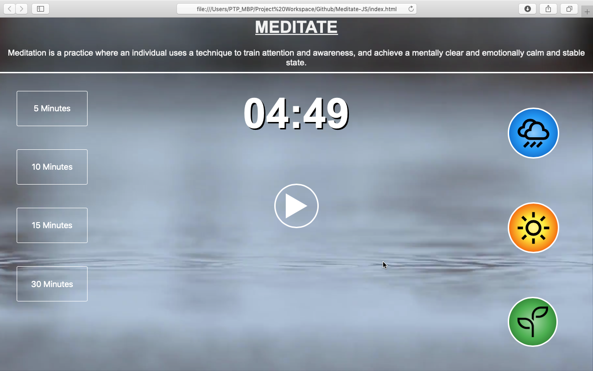
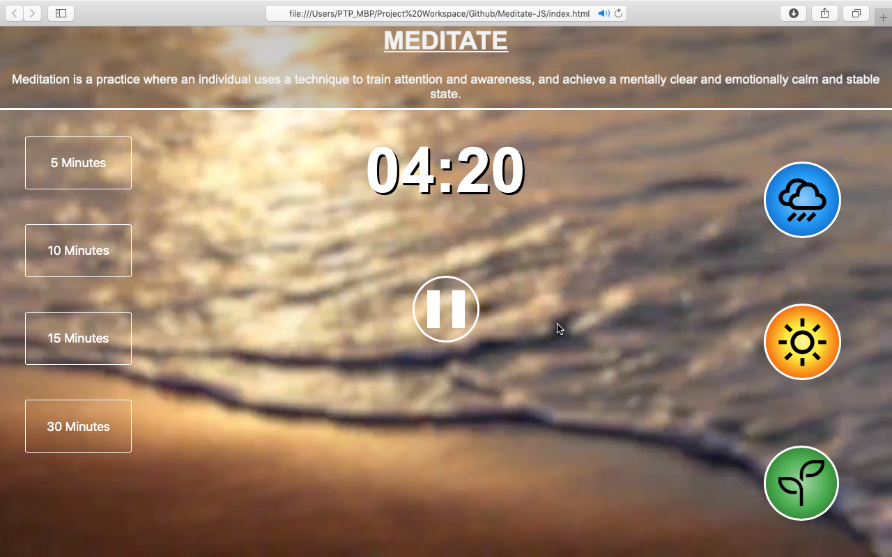
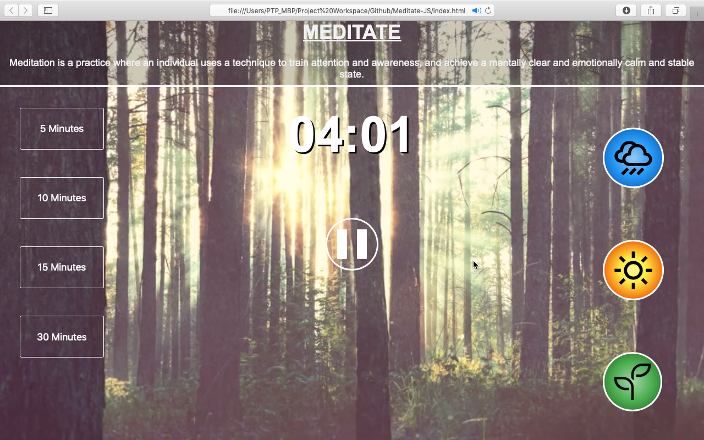

# Meditate-JS
### Overview :
* A simple webpage to demonstrate the use of audio and video tags in HTML along with the setInterval() and setTimeOut() functions in javascript.
* The user can set a timer for a given time by clicking on any buttons on the left.
* The user can also choose between different video and audio themes by clicking on any of the buttons on the right (Rain, Beach Waves, Forest).

### Screenshots : 

